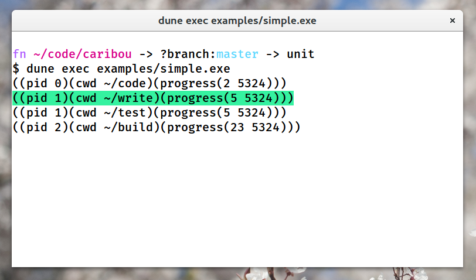

# Caribou

Caribou is an OCaml library for generating terminal user interfaces
using [Notty](https://github.com/pqwy/notty).



Caribou takes a module that satisfies the following signature

```ocaml
module type Caribou_app = sig
  type item

  val show : item -> selected:bool -> Notty.image

  val inspect : item -> Notty.image

  val list : unit -> item list
end
```

and generates a way for users to navigate and view these items.

## Performance

The functions `show` and especially `list` should both be very performant.
If there is caching that needs to be done, that is left up to the
application. `list`, for example, is called on every key press on the
index page.

## Future work

At the moment, you can only list the items and view them. It would be nice
if Caribou apps could also specify ways to interact with the individual
items and providing accompanying keybindings. For instance, in the [file
example](./examples/files.ml) there is no way to delete, rename, or edit
a given file.

